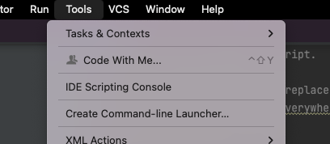
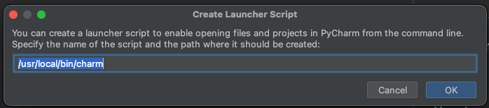

[/ home](../README.md) / Installment for 2019 and 2020
## Installation

### Requirements
You need Alfred 3.5+  

This workflow needs to ensure that Pycharm's command line launcher is working:    
#### Create command line launcher
**Step Example**:  
    1. Open The Pycharm App  
    2. Go to Tools and Create Command-line Launcher, as follows:    
        
    3. In the popup windows, just click on OK  
     
    
### Install
1. Download workflow from `package` folder, or [here](./package/alfred-open-pycharm.alfredworkflow?raw=true)
2. Double-click on downloaded file (alfred-open-pycharm.alfredworkflow)

### How to use
**Keywords:**  
- `charm`: Search for recently opened projects
- `charmf`: Search for folders that are not recently opened projects

**Example**   
- Search `Open Recent`   
  1) Step 1    
     
  2) Step 2    
    Select a project searched and press the `Enter` key, this will open the project using `Pycharm APP`.   
    
- Reveal a project in Finder
  1) Step 1    
    
  2) Step 2    
  Select a project searched and press the `option` + `Enter` key, this will reveal the project in Finder. 
